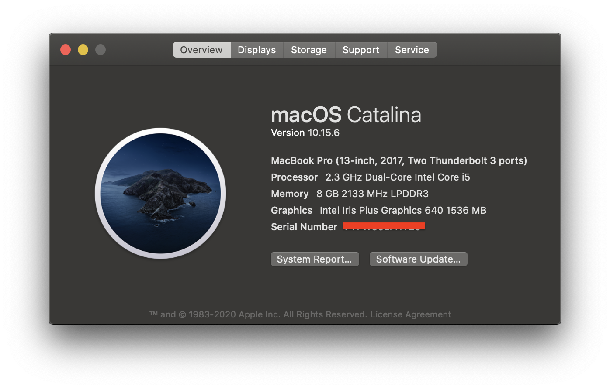

## Build

### 配置 `makefile`

我们在实现时依赖 Gurobi 模块来解决相应的最优化问题，因此在编译之前需要先配置好本机 Gurobi 的链接路径等具体信息。

下面的讨论中我们的默认开始路径是项目的根目录。

首先是`src/makefile`，其具体内容如下

```makefile
IDIR =../include/
CXX=clang++
CFLAGS=-I$(IDIR) -Wall -Wextra -O2 -std=c++17 -I/Library/gurobi902/mac64/include
CLIBS=-L/Library/gurobi902/mac64/lib -lgurobi_c++ -lgurobi90
LIB = ../lib/liboer.a

ODIR=obj

_DEPS = gen.h mmcf.h ploter.h router.h graph.h layout.h io.h
DEPS = $(patsubst %,$(IDIR)/%,$(_DEPS))

_OBJ = gen.o mmcf.o ploter.o router.o layout.o graph.o io.o
OBJ = $(patsubst %,$(ODIR)/%,$(_OBJ))

$(ODIR)/%.o: %.cpp $(DEPS)
	$(CXX) -c -o $@ $< $(CFLAGS)

$(LIB): $(OBJ) $(DEPS)
	ar -rv $(LIB) $(OBJ)
	ranlib $(LIB)

.PHONY: clean

clean:
	rm -f $(ODIR)/*.o *~ $(INCDIR)/*~
```

假设本机的 Gurobi 路径为 `<path_to_gurobi>`，那么你需要将第 3 行以及第 4 行的 `/Library/gurobi902/mac64/`替换成 `<path_to_gurobi>`，同时将第 4 行的 `-lgurobi90` 替换成系统中对于的版本。

同时为了能给编译我给出的两个样例程序 `example/demo.cpp`以及`example/gen.cpp`，你需要将 `example/makefile`进行同样的修改。

### 编译生成 `lib` 文件

在根目录下执行

```bash
cd src
make clean
make
```

### 编译样例代码

在根目录下执行

```bash
cd example
make clean
make demo
make gen
```

## Usage

为了演示如何使用，在`example`目录下我提供了两个样例程序，分别是 `demo.cpp` 以及`gen.cpp`。其中 `demo.cpp`可以读入格式化输入的信息，对路径进行规划后将结果保存为 `.dot` 或者`.pdf`文件，其中`.pdf`文件的生成需要依赖`graphviz`。

### demo.cpp

#### 输入格式

第一行为 4 个整数，用空格隔开，分别是矩阵的行数$m$，列数$n$，可行的状态$s$，以及 PIN 的数量$q$。对于可行的状态，我们将上右下左分别标号为 0123，如果$s$二进制的第$i$位是 $1$，那么这一边就是可行的。

接下来$q$行，每行两个整数 $x,y$，用空格隔开，代表 PIN 的坐标，其中满足 $0 \leq x < m,0\leq y < n$。

#### 示例

我们在 `testcase/sample`中提供了样例的输入与输出。

在`example/`中运行

``` bash
./demo ../testcase/sample/result.pdf < ../testcase/sample/in
```

输出的可视化文件为  `testcase/sample/result.pdf`

### gen.cpp

为了测试性能，我们需要随机生成数据，注意到完全随机的情况下很难生成有解的情况，因此我额外实现了一个模块，这个模块保证可以根据输入的$m,n,s,q$随机生成一组数据，并通过一定的算法将这个数据调整成有解的情况。

#### 示例

在 `example` 中运行

```bash
./gen 10 10 1111 15
```

可以得到输出

```
10 10 15 15
1 8
3 3
4 6
5 8
6 8
8 8
6 6
7 5
5 4
9 4
6 3
6 2
8 1
4 1
4 0
```

这即为一组一定存在解的输入数据

## Statistics

基于 `demo.cpp` 和 `gen.cpp`，我们便可以进行一些相关的测试了。

我本机的基本配置如下：



以下是测得的数据：

| Case ID |  m   |  n   | type |  q   | length | time  |
| :-----: | :--: | :--: | :--: | :--: | :----: | :---: |
|    1    |  8   |  6   |  1   |  6   |   22   | 0.25s |
|    2    |  8   |  6   |  2   |  6   |   9    | 0.25s |
|    3    |  8   |  6   |  2   |  11  |   32   | 0.47s |
|    4    |  10  |  6   |  3   |  25  |   66   | 4.04s |
|    5    |  9   |  6   |  2   |  11  |   27   | 0.48s |
|    6    |  8   |  8   |  1   |  8   |   33   | 0.38s |
|    7    |  20  |  15  |  2   |  33  |  233   | 68.6s |

所有的测试数据均位于 `testcase/`的同名目录下。

## Story

以下是我在完成本次作业的一些心路历程。

首先，对于老师给出的几个选题，我分别了解一下，由于对机器学习没什么了解，因此后面几个机器学习的项目我都略过了，所以我能选择的难度最高就是这个 Ordered Escape Routing。除此之外，我还对那个写游戏的项目比较感兴趣，但是非常遗憾那个框架已经不支持 Xcode10 了，因此我就选择了现在这个项目。

因为我对 SAT 问题有一定的了解，因此选择了那个基于 SAT 的解法。那篇论文大体上可以分成三部分，首先介绍了一般的基于 SAT 的解法，第二个部分介绍了基于 SAT 的返回结果对局面进行微调，使得最后得出一个可以接受的解，第三个部分介绍了将这个解法嵌入一些其他的算法中处理更大规模的数据的情况。

在大体读了一遍论文后，我很快的就实现好了第一个部分，在自己生成的测试数据上也得到了很好的效果。可是当我想要实现第二个部分时，却发现论文里的细节描述非常模糊，在很多地方难以理解作者想要表达什么。尽管如此，根据大体的思路我还是做出来了一个版本，但是这个版本要么能处理的局面很特定，要么就需要极其漫长的时间来运行，远达不到论文里所提出的效果。

在这一阶段阻塞了半个月左右之后，我决定先实现第三个部分。但是令我倍感绝望的是第三个部分的描述更加语焉不详。于是我决定向助教求助，最后得到的反馈是第三个部分的实现需要参考另一篇论文。因为这时候临近期中考试，因此这个大作业我就先搁置到了这里。

可是，半个月后，当我尝试理解另一篇论文时，却发现这和那个第三部分的描述并没有什么关系，而当我再次向助教求助时，就得不到什么有效的信息了。虽然最后老师同意取消了后两个部分，但是当前仅有第一个部分的实现难说完整，工作量也显得很小，因此我决定另起炉灶实现另一个货物流的做法。

在我的设想里，货物流的做法应该是远比 SAT 的做法跑得快的，但是当我实现完之后，却发现在大部分数据上货物流的做法是比 SAT 的做法来的要慢的。并且，两种做法对具体的数据都是高度依赖的，比如随机生成的数据即使有解，两种做法都需要很长的时间来确定解。

不难发现，对于那些能快速出解的数据，他们共有的特点就是在边界上有大量的 PIN，这些 PIN 在很大程度上起到了剪枝的作用，很大的降低了实际需要处理的数据的规模。如果我们把这些 PIN 挪到相对靠中间的位置，计算的时间就会变得异常漫长。

或者来说，我们可以这样认为，这些论文里给出的 benchmark 如果没有给出具体的数据，那么就毫无比较的意义，同样的数据规模对具体的分布稍加调整时间上就会有非常大的差距。所以，为了实现老师在要求中提出的随机生成数据，我们就必须额外实现一个复杂的生成器，来生成合法的输入数据。对此，我的做法是先生成随机数据，然后在上面跑一遍网络流来确定一个无序时的方案，再根据这个方案来确定最终的顺序。

坦率的讲，这个作业完成下来给我整体的感受是异常疲惫的。在这个过程中我的大量时间耗费在揣摩论文作者的意图与调整已有的实现，而本应是主要部分的对 OOP 的练习与实践却占了很小一部分。对此，我希望老师和助教在布置作业之前可以对作业的具体内容有个大体的了解，哪怕只是提前阅读一遍需要实现的论文，都可以给学生减少很多不必要的负担，帮助学生把精力投入在更有价值的事情上。

